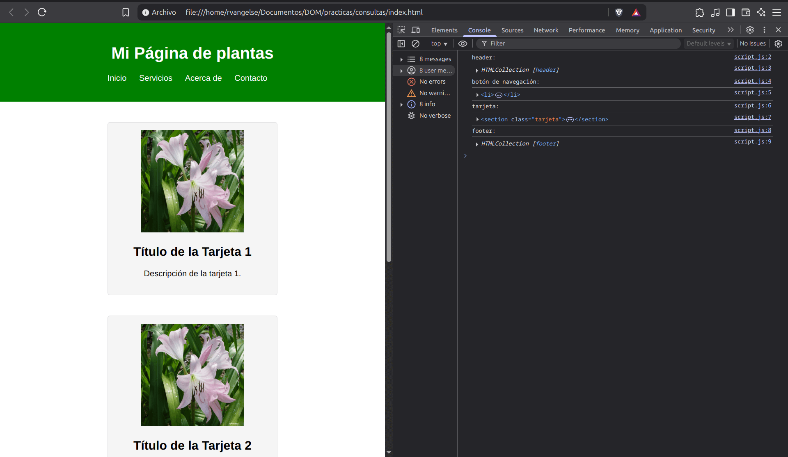

# Consultas

## Consultas por id

**index.js**

```js
let saludo = document.getElementById("saludo");
console.log(saludo);
```
**Output en el navegador**

<p align="center">
    
    </p>

OJO: `getElementById()` sólo devolverá el primer elemento que encuentre con la ID que le pases, ignorando los demás.

OJO: Ten cuidado donde pones el `script` en tu HTML. Primero, debe renderizarse el elemento que vas a pedir.

## Consultas por class

**index.js**
```js
//Por Clase
let consultas = document.getElementsByClassName("consulta");
console.log(consultas);

//Por Etiqueta
let divs = document.getElementsByTagName("div");
console.log(divs);

//Ambos retornan una HTMLCollection
```
**Output en el navegador**

<p align="center">
    
    </p>

OJO: Si solo deseas manipular un elemento específico, es importante usar el índice apropiado o bien iterar a través de todos los elementos.

## Propiedades

**index.js**

```js
//Obtengo el último elemento que seleccione en el navegador
const ultimoElemento = $0;
console.log(ultimoElemento);

//Obtengo la URL de mi página
const URL = document.URL;
console.log(URL);

//Obtengo el body de mi página
const body = document.body;
console.log(body);

//Obtengo la fuente de la primera imágen de mi página
const imagen = document.images[0];
console.log(imagen.src);
```
OJO: Nodos heredan propiedades de otros objetos del DOM: HTMLImageElement < HTMLElement < Element < Node < EventTarget < Object

**Output en el navegador**

<p align="center">
    
    </p>

## Consultas usando selectores de CSS
Puedes usar los selectores de CSS para obtener elementos de tu página.

**index.js**
```js
//Obtengo la sección "proyectos" seleccionandola desde su id
document.querySelector('#proyectos');

//Obtengo el primer elemento que tenga la etiqueta "figure"
document.querySelector('figure');

//Obtengo todos los elementos con la etiqueta "figure" de la sección "proyectos" 
document.querySelectorAll('#proyectos figure');
```
**Output en el navegador**

<p align="center">
    
    </p>

## Práctica 1: Consultas usando el DOM

**Código**

**index.html**

```html
<!DOCTYPE html>
<html lang="es">
<head>
    <meta charset="UTF-8">
    <title>Página Atractiva</title>
    <link rel="stylesheet" href="styles.css">
</head>
<body>

    <header>
        <h1>Mi Página de plantas</h1>
        <nav>
            <ul>
                <li><a href="#">Inicio</a></li>
                <li><a href="#">Servicios</a></li>
                <li><a href="#">Acerca de</a></li>
                <li><a href="#">Contacto</a></li>
            </ul>
        </nav>
    </header>

    <main>
        <section class="tarjeta">
            
            <h2>Título de la Tarjeta 1</h2>
            <p>Descripción de la tarjeta 1.</p>
        </section>

        <section class="tarjeta">
            
            <h2>Título de la Tarjeta 2</h2>
            <p>Descripción de la tarjeta 2.</p>
        </section>

        <section class="tarjeta">
            
            <h2>Título de la Tarjeta 3</h2>
            <p>Descripción de la tarjeta 3.</p>
        </section>

        <section class="informacion">
            <h2>Información Importante</h2>
            <p>Lorem ipsum dolor sit amet, consectetur adipiscing elit. Nullam vel purus sit amet nisl dignissim tempus eu eu ex.</p>
        </section>
    </main>

    <footer>
        <p>&copy; 2025 Mi Página Atractiva. Todos los derechos reservados.</p>
    </footer>

    <script src="script.js"></script>
</body>
</html>
```
**styles.css**

```css
body {
    font-family: Arial, sans-serif;
    margin: 0;
    padding: 0;
}

header {
    background-color: green;
    color: white;
    padding: 20px;
    text-align: center;
}

nav ul {
    list-style: none;
    padding: 0;
}

nav li {
    display: inline;
    margin-right: 20px;
}

nav a {
    text-decoration: none;
    color: white;
}

main {
    display: flex;
    justify-content: space-around;
    align-items: flex-start;
    flex-wrap: wrap;
    padding: 20px;
}

.tarjeta {
    background-color: #f5f5f5;
    border: 1px solid #ddd;
    border-radius: 5px;
    padding: 15px;
    margin: 20px;
    width: 300px;
    text-align: center;
}

.informacion {
    width: 100%;
    display: flex;
    flex-direction: column;
    align-items: center;
}

img {
    height: 200px;
    width: 200px;
}

footer {
    background-color: green;
    color: white;
    text-align: center;
    padding: 10px;
}
```
**script.js**

```js
console.log("header:");
console.log(document.getElementsByTagName("header"));
console.log("botón de navegación:"); 
console.log(document.querySelector("nav li"));
console.log("tarjeta:");
console.log(document.querySelector(".tarjeta"));
console.log("footer:"); 
console.log(document.getElementsByTagName("footer"));
```
**Output en el navegador**

<p align="center">
    
    </p>
