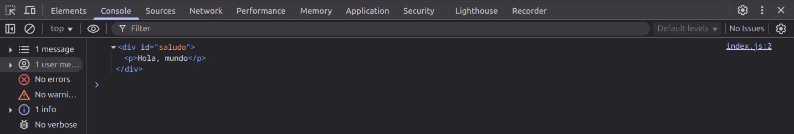
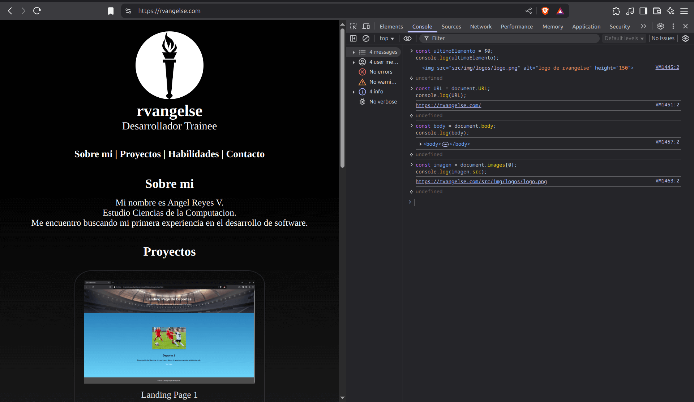
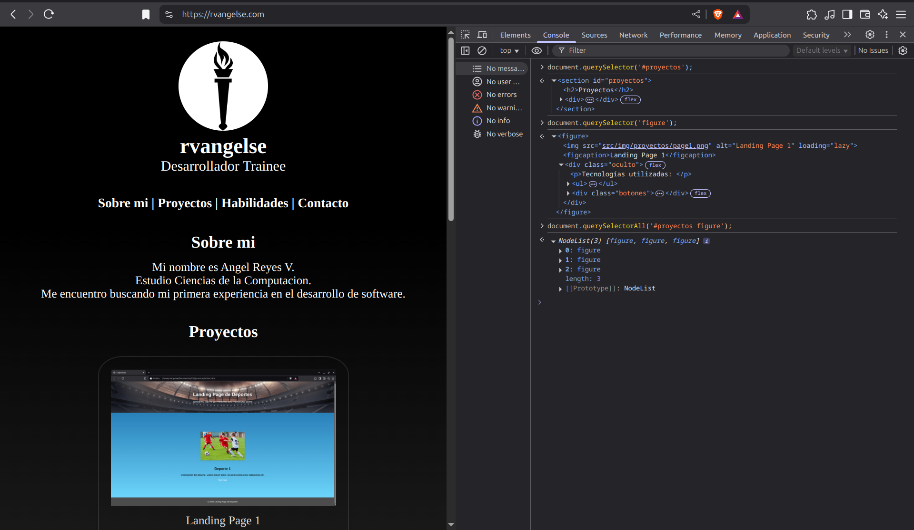

# Consultas

## Consultas por id

**index.js**

```js
let saludo = document.getElementById("saludo");
console.log(saludo);
```
**Output en el navegador**

<p align="center">
    
    </p>

OJO: `getElementById()` sólo devolverá el primer elemento que encuentre con la ID que le pases, ignorando los demás.

OJO: Ten cuidado donde pones el `script` en tu HTML. Primero, debe renderizarse el elemento que vas a pedir.

## Consultas por class

**index.js**
```js
//Por Clase
let consultas = document.getElementsByClassName("consulta");
console.log(consultas);

//Por Etiqueta
let divs = document.getElementsByTagName("div");
console.log(divs);

//Ambos retornan una HTMLCollection
```
**Output en el navegador**

<p align="center">
    
    </p>

OJO: Si solo deseas manipular un elemento específico, es importante usar el índice apropiado o bien iterar a través de todos los elementos.

## Propiedades

**index.js**

```js
//Obtengo el último elemento que seleccione en el navegador
const ultimoElemento = $0;
console.log(ultimoElemento);

//Obtengo la URL de mi página
const URL = document.URL;
console.log(URL);

//Obtengo el body de mi página
const body = document.body;
console.log(body);

//Obtengo la fuente de la primera imágen de mi página
const imagen = document.images[0];
console.log(imagen.src);
```
OJO: Nodos heredan propiedades de otros objetos del DOM: HTMLImageElement < HTMLElement < Element < Node < EventTarget < Object

**Output en el navegador**

<p align="center">
    
    </p>

## Consultas usando selectores de CSS
Puedes usar los selectores de CSS para obtener elementos de tu página.

**index.js**
```js
//Obtengo la sección "proyectos" seleccionandola desde su id
document.querySelector('#proyectos');

//Obtengo el primer elemento que tenga la etiqueta "figure"
document.querySelector('figure');

//Obtengo todos los elementos con la etiqueta "figure" de la sección "proyectos" 
document.querySelectorAll('#proyectos figure');
```
**Output en el navegador**

<p align="center">
    
    </p>

