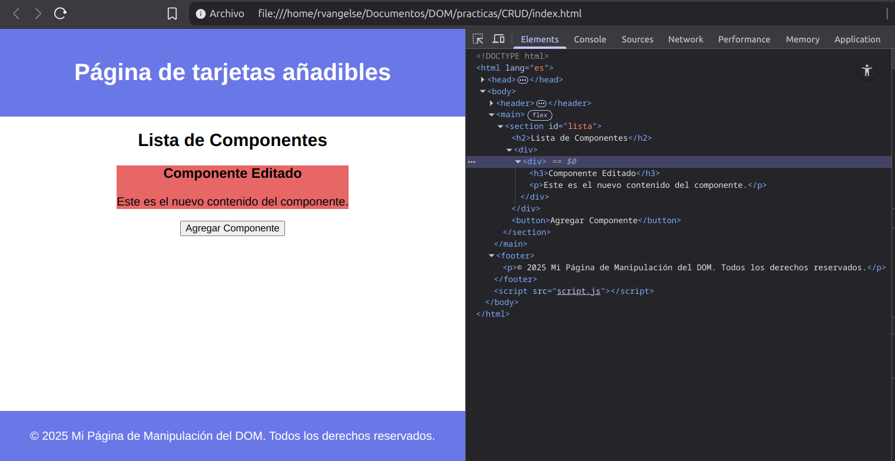

# Create, Read, Update, Delete (CRUD)
CRUD representa las cuatro operaciones fundamentales que se realizan a la hora de manipular información: `crear`, `leer`, `editar` y `eliminar`.
## Crear
Usando el DOM, puedes crear elementos en tu arhivo `.html` ,de forma `dinámica`. 

```js
//Selecciono el título de mi archivo .html
let titulo =  document.querySelector('h1');
//Creo  un nuevo elemento "span"
let span = document.createElement('span');
//Le asigno el contenido "?"
span.textContent = '?';
//Lo agrego como último hijo de la etiqueta "h1"
titulo.appendChild(span);

//Lo agrego antes de la etiqueta "h1"
titulo.insertAdjacentHTML('beforebegin', span);
//Lo agrego como primer hijo de la etiqueta "h1"
titulo.insertAdjacentHTML('afterbegin', span);
//Lo agrego como último hijo de la etiqueta "h1"
titulo.insertAdjacentHTML('beforeend', span);
//Lo agrego después de la etiqueta "h1"
titulo.insertAdjacentHTML('afterend', span);
```
OJO: También, puedes usarlo así: `div.insertAdjacentHTML('beforeend',"<p>Texto insertado</p>");`

## Leer (Navegar por el DOM)

```js
//Selecciono todas las imágenes de mi documento
let imagenes = document.querySelectorAll('img');
//Selecciono la segunda imágen
let segundoNodo = imagenes[1];
//Selecciono al elemento que contiene a la segunda imágen
let nodoPadre = segundoNodo.parentElement;
//Selecciono al elemento que contiene a este último
let nodoAbuelo = nodoPadre.parentElement;

//Selecciono la etiqueta "body"
let body = document.body;
//Selecciono todos los elementos que esta contiene
let nodosHijos = body.children;
//Selecciono el primer elemento dentro de "body"
let primerNodo = nodosHijos[0];

//Selecciono el primer elemento dentro de "body"
let primerHijo = nodosHijos.firstElementChild;
//Selecciono el último elemento dentro de "body"
let ultimoHijo = nodosHijos.lastElementChild;
```
## Editar

```js
let h1 = document.querySelector('h1');

//Cambio el título de mi documento
h1.innerHTML = '<b>Nuevo título en negritas</b>';
```
OJO: No manipules el DOM directamente para actualizar la interfaz de usuario. En su lugar, utiliza los métodos y propiedades integradas de tu biblioteca o framework que estes usando.

## Eliminar

```js
let h1 = document.querySelector('h1');
//Elimino el título de mi documento
h1.remove();

let imagenes = document.querySelector('contenedor');
//Elimino la primera imagen 
imagenes.removeChild(imagenes.children[0]);
```
## Práctica 2: CRUD

**Código**

**index.html**
```html
<!DOCTYPE html>
<html lang="es">
<head>
    <meta charset="UTF-8">
    <title>Manipulación del DOM</title>
    <link rel="stylesheet" href="styles.css">
</head>
<body>

    <header>
        <h1>Página de tarjetas añadibles</h1>
    </header>

    <main>
        <section id="lista">
            <h2>Lista de Componentes</h2>
            <div></div>
            <button>Agregar Componente</button>
        </section>
    </main>

    <footer>
        <p>&copy; 2025 Mi Página de Manipulación del DOM. Todos los derechos reservados.</p>
    </footer>

    <script src="script.js"></script>
</body>
</html>
```
**styles.css**
```css
body {
    font-family: Arial, sans-serif;
    margin: 0;
    padding: 0;
}

header {
    background-color: rgb(106, 119, 230);
    color: white;
    padding: 20px;
    text-align: center;
}

main {
    display: flex;
    justify-content: center;
    height: 400px;
}

#lista {
    text-align: center;

    div{
        background-color: rgb(231, 103, 103);
    }
}

ul {
    list-style: none;
    padding: 0;
}

li {
    margin: 10px 0;
}

footer {
    background-color: rgb(106, 119, 230);
    color: white;
    text-align: center;
    padding: 10px;
}
```
**script.js**
```js
//Selecciono el contenedor de la lista
let componenteLista = document.querySelector('#lista div');

//Creo un nuevo componente (div) y lo añado a la lista
let nuevoComponente = document.createElement('div');
nuevoComponente.innerHTML = `
    <h3>Primer Componente</h3>
    <p>Descripción</p>
`;
componenteLista.appendChild(nuevoComponente);


const primerComponente = componenteLista.firstChild;
// Si existe el primer componente, lo edito
if (primerComponente) {
    primerComponente.innerHTML = `
        <h3>Componente Editado</h3>
        <p>Nueva descripción</p>
    `;
}
```
**Output en el navegador**

<p align="center">
    
</p>