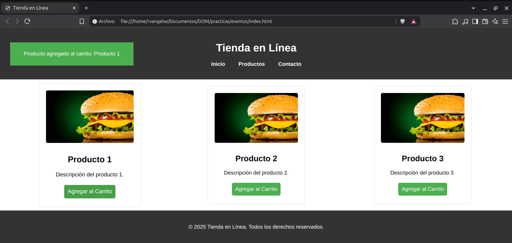

# Eventos
## Monitoreo de eventos

```js
let boton = document.querySelector('button');

//Estamos monitoreando los "clicks" sobre el botón
monitorEvents(boton, 'click');
//Dejamos de monitorear
unmonitorEvents(boton, 'click');
```
OJO: Utiliza `unmonitorEvents` cuando ya no necesites un monitor de eventos.

## Escuchar eventos

```js
//Cuando se escuche un "click" en el documento, se imprimira en consola "Recibí un click"
document.addEventListener('click', ()=> {
    console.log('Recibí un click!');
});
```
## Burbujeo
Sirve para asignar un orden a la escucha de eventos

```js
let documento = document;
let body = document.body;
let svg = document.querySelector('.imagen-svg');

/* Al hacer click sobre la imágen, los eventos se escucharán en el siguiente orden:
   imágen -> burbujeo -> body -> burbujeo -> documento */
documento.addEventListener('click', () => {
    console.log('Clic en documento');
});

body.addEventListener('click', () => {
    console.log('Clic en body');
});

svg.addEventListener('click', () => {
    console.log('Clic en imagen');
});

/* Al hacer click sobre la imágen, los eventos se escucharán en el siguiente orden: 
   documento -> body -> imagén */
documento.addEventListener('click', () => {
    console.log('Clic en documento: captura');
}, true);

body.addEventListener('click', () => {
    console.log('Clic en body: captura');
}, true);

svg.addEventListener('click', () => {
    console.log('Clic en imagen: captura');
}, true);
```
OJO: Puedes detener la propagación del burbujeo, usando `.stopPropagation()`

Por ejemplo:
```js
    let documento = document;
    let body = document.body;
    let svg = document.querySelector('.imagen-svg');

    documento.addEventListener('click', () => {
    console.log('Clic en documento');
    });

    body.addEventListener('click', () => {
        console.log('Clic en body');
    });

    svg.addEventListener('click', evento => {
        console.log('Clic en imagen');
        //Se detiene el burbujeo y solo se escucha el evento de imágen
        evento.stopPropagation(); 
    });
```
## El objeto "evento"

```js
let svg = document.querySelector('.imagen-svg');

//Puedes capturar el evento en el callback e imprimir sus atributos
svg.addEventListener('click', evento => {
    console.log(evento);
    console.log(evento.clientX);
    console.log(evento.clientY);
    console.log(evento.pageX);
    console.log(evento.pageY);
    console.log(evento.pointerType);
    console.log(evento.type);
    console.log(evento.target);
});
```
## Prevenir el comportamiento predeterminado de un evento 

```js
let enlace = document.querySelector('a.enlace');

enlace.addEventListener('click', evento => {
    console.log('Previene navegación predeterminada');
    //Detiene el comportamiento predeterminado de "redirección" de "a"
    evento.preventDefault();
}, true);
```
## Dejar de escuchar eventos

```js
let svg = document.querySelector('.imagen-svg');

function agrandar() {
    svg.style.transform = 'scale(2)';
}

svg.addEventListener('click', agrandar);
//Dejo de escuchar el evento 'click'
svg.removeEventListener('click', agrandar);
```
## Práctica 4: Eventos en el DOM 

**Código:**

**index.html**
```html
<!DOCTYPE html>
<html lang="es">
<head>
    <meta charset="UTF-8">
    <title>Tienda en Línea</title>
    <link rel="stylesheet" href="styles.css">
    <script defer src="script.js"></script>
</head>
<body>

    <header>
        <h1>Tienda en Línea</h1>
        <nav>
            <ul>
                <li><a href="#">Inicio</a></li>
                <li><a href="#">Productos</a></li>
                <li><a href="#">Contacto</a></li>
            </ul>
        </nav>
    </header>

    <main>
        <section class="producto" id="producto1">
            
            <h2>Producto 1</h2>
            <p>Descripción del producto 1.</p>
            <button class="agregar-carrito">Agregar al Carrito</button>
        </section>

        <section class="producto" id="producto2">
            
            <h2>Producto 2</h2>
            <p>Descripción del producto 2.</p>
            <button class="agregar-carrito">Agregar al Carrito</button>
        </section>

        <section class="producto" id="producto3">
            
            <h2>Producto 3</h2>
            <p>Descripción del producto 3.</p>
            <button class="agregar-carrito">Agregar al Carrito</button>
        </section>
    </main>

    <div class="mensaje" id="mensaje">
        <p id="mensaje-contenido">Producto añadido al carrito</p>
    </div>

    <footer>
        <p>&copy; 2025 Tienda en Línea. Todos los derechos reservados.</p>
    </footer>
</body>
</html>
```
**styles.css**
```css
body {
    font-family: 'Segoe UI', Tahoma, Geneva, Verdana, sans-serif;
    margin: 0;
    padding: 0;
}

header {
    background-color: #333;
    color: white;
    padding: 20px;
    text-align: center;
}

nav ul {
    list-style: none;
    padding: 0;
    display: flex;
    justify-content: center;
}

nav a {
    text-decoration: none;
    color: white;
    margin: 0 20px;
    font-weight: bold;
}

main {
    display: flex;
    justify-content: space-around;
    padding: 20px;
}

img{
    height: 150px;
    width: 50px;
}

footer{
    color: white;
    background-color: #333;
    height: 100px;
    display: flex;
    align-items: center;
    justify-content: center;
}


.producto {
    border: 1px solid #ddd;
    padding: 20px;
    text-align: center;
    border-radius: 5px;
    width: 250px;
    transition: transform 0.3s;
}

.producto:hover {
    transform: scale(1.05);
}

.producto img {
    width: 100%;
    border-radius: 5px;
    margin-bottom: 10px;
}

.agregar-carrito {
    background-color: #4CAF50;
    color: white;
    border: none;
    padding: 10px;
    text-align: center;
    text-decoration: none;
    display: inline-block;
    font-size: 16px;
    margin: 4px 2px;
    cursor: pointer;
    border-radius: 5px;
    transition: background-color 0.3s;
}

.agregar-carrito:hover {
    background-color: #45a049;
}

/* Estilos para el mensaje */
#mensaje {
    display: none;
    position: fixed;
    top: 5%;
    left: 30px;
    width: 350px;
    height: 50px;
    background-color: #4CAF50; /* Cambiado a verde */
    color: white;
    padding: 10px;
    border-radius: 0; /* Sin bordes redondeados */
    text-align: center;
    z-index: 1000; /* Colocar sobre otros elementos */
}
```
**script.js**
```js
let productos = document.querySelectorAll('.producto');
let mensaje = document.getElementById('mensaje');
let mensajeContenido = document.getElementById('mensaje-contenido');

//Escuchamos el evento click de cada producto
productos.forEach(producto => {
    producto.addEventListener('click', function() {
        // Mostramos el mensaje
        mensajeContenido.textContent = `Producto agregado al carrito: ${producto.querySelector('h2').textContent}`;
        mensaje.style.display = 'block';

        // Ocultamos el mensaje después de 2 segundos
        setTimeout(function() {
            mensaje.style.display = 'none';
        }, 2000);
    });
});
```
**Output:**
<p align="center">
    
</p>
