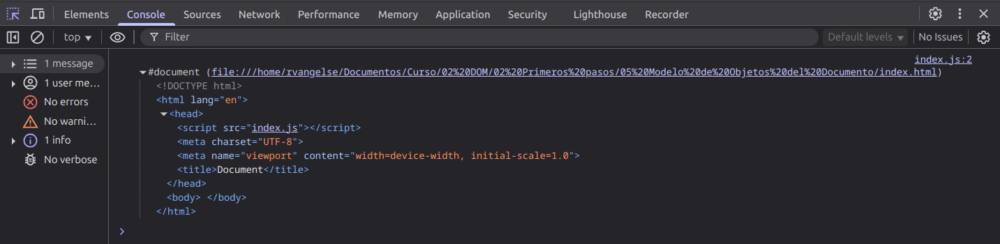

# Document Object Model (DOM)
Es una Web API que permite que JS manipule al HTML y CSS para crear páginas y aplicaciones web dinámicas.

### Veamos el DOM: 

**index.js**

```js
const DOM = document;
console.log(document);
```
**Output en la consola del navegador**

<p align="center">
    
    </p>

OJO: Evita la manipulación excesiva y constante del DOM. En su lugar, intenta agrupar tus cambios y hacerlos todos a la vez. Esto mejorará el rendimiento de tu código al reducir el coste computacional de la renderización constante del DOM.