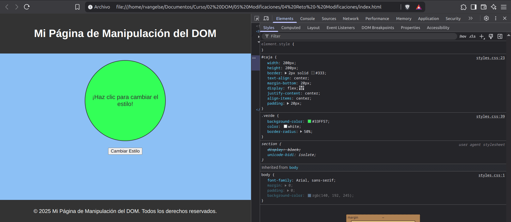

# Modificaciones
## CSS

```js
let titulo = document.querySelector('h1');

//Cambio los estilos CSS del título
titulo.style.color = 'blue';
titulo.style.fontSize = '100px';

//Otra forma de hacer lo mismo
titulo.style.cssText = 'color: blue; font-size: 100px;';
```
OJO: `CSS` usa guión, por ejemplo: `font-size`, `JS` usa camelCase, por ejemplo: `fontSize`

## Atributos

```js
let imagen = document.getElementById("miImagen");

//Cambie los atributos fuente texto alternativo de miImagen
imagen.setAttribute("src", "ruta/a/la/imagen.jpg");
imagen.setAttribute("alt", "Texto alternativo de la imagen");
```
## Classes

```js
let titulo= document.querySelector('h1');

//Obtengo las clases asociadas al título
let listaDeClases = titulo.classList;

//Añado la clase rojo al final de la lista (Se aplicará)
listaDeClases.add('rojo'); 
//Regreso a la clase anterior a rojo 
listaDeClases.remove('rojo'); 
//Funciona como un interruptor 
ListaDeClases.toggle('rojo'); 
//Devuelve un bool que indica si la clase rojo esta asociada al título
ListaDeClases.contains('rojo'); // contiene clase
```
## Práctica 3: Modificaciones usando el DOM

**Código**

**index.html**
```html
<!DOCTYPE html>
<html lang="es">
<head>
    <meta charset="UTF-8">
    <title>Manipulación del DOM</title>
    <link rel="stylesheet" href="styles.css">
</head>
<body>

    <header>
        <h1>Mi Página de Manipulación del DOM</h1>
    </header>

    <main>
        <section id="caja">
            <p id="mensaje">¡Haz clic para cambiar el estilo!</p>
        </section>
        <button>Cambiar Estilo</button>
    </main>

    <footer>
        <p>&copy; 2025 Mi Página de Manipulación del DOM. Todos los derechos reservados.</p>
    </footer>
    <script src="script.js"></script>
</body>
</html>
```
**styles.css**
```css
body {
    font-family: Arial, sans-serif;
    margin: 0;
    padding: 0;
    background-color: rgb(140, 192, 245);
}

header {    
    background-color: #333;
    color: white;
    padding: 20px;
    text-align: center;
}

main {
    display: flex;
    flex-direction: column;
    align-items: center;
    padding: 20px;
    height: 400px;
}

#caja {
    width: 200px;
    height: 200px;
    border: 2px solid #333;
    text-align: center;
    margin-bottom: 20px;
    display: flex;
    justify-content: center;
    align-items: center;
    padding: 20px;
}

p{
    color: white;
}

.verde {
    background-color: #33FF57;
    color: white;
    border-radius: 50%;
}

.negrita {
    font-size: 18px; 
    color: #333;
}

footer {
    background-color: #333;
    color: white;
    text-align: center;
    padding: 10px;
}
```
**script.js**
```js
let caja = document.getElementById('caja');
let mensaje = document.getElementById('mensaje');

caja.classList.toggle('verde');

mensaje.classList.toggle('negrita');
```
**Output en el navegador**

<p align="center">
    
</p>

