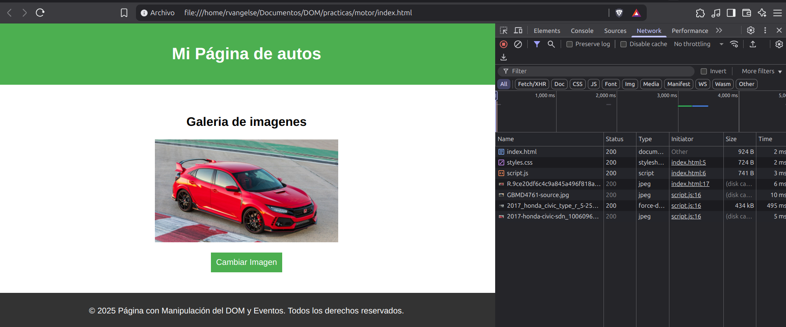

# El motor de JavaScript

## Web APIs

Una API (Application Programming Interface) es una interfaz que permite que un sistema se comunique mediante mensajes que ambos entienden.

Por ejemplo, el DOM es una Web API que permite a JS (script) interactuar con la estructura de tu página web (HTML/CSS) a tráves del navegador.

```js
//Registro el performance en ms de la página en el momento actual
let antes = performance.now();

//Armo un loop
for (let i = 0; i < 400; i++) {
    let elemento = document.createElement('p');
    elemento.textContent = 'Este es un párrafo';
    document.body.appendChild(elemento);
}

//Registro el performance, después del loop
let despues = performance.now();

//Imprimo cuanto tarda en ejecutarse el loop completo
console.log(despues - antes);

/* Es ineficiente ya que esta creando elementos y añadiendolos al DOM, en cada iteración.
   Es más eficiente, crear todos los elementos, añadirlos a un fragmento del DOM y después, fuera del loop añadirlos al DOM */

let antes = performance.now();

//Creo un fragmento del DOM
let fragmento = document.createDocumentFragment();

for (let i = 0; i < 400; i++) {
    let elemento = document.createElement('p');
    elemento.textContent = 'Este es un párrafo';
    fragmento.appendChild(elemento);
}
//Añado el fragento que contiene todos los nuevos elementos al DOM
document.body.appendChild(fragmento);

let despues = performance.now();

//El tiempo de performance mejoró
console.log(despues - antes);
```
## La pila de llamadas
JS es un lenguaje de un solo hilo, es decir, todo se procesa en serie.

Si queremos usar procesamiento paralelo, debemos usar Web APIs.

```js
function multiplicar(a, b) {
    return a * b;
}

function cuadrado(a) {
    return multiplicar(a, a);
}

function imprimirCuadrado(a) {
    const resultado = cuadrado(a);
    console.log(resultado);
}

imprimirCuadrado(4);

/* 
    Call Stack: 

    Se cargan todos los respectivos llamados en la pila, después se van procesando
    y desapilando, en serie.

        []                             
        [imprimirCuadrado]
        [imprimirCuadrado, cuadrado]
        [imprimirCuadrado, cuadrado, multiplicar]
        [imprimirCuadrado, cuadrado, multiplicar, a * b]
        [imprimirCuadrado, cuadrado, multiplicar]
        [imprimirCuadrado, cuadrado]
        [imprimirCuadrado, console.log]
        [imprimirCuadrado]
        []
*/
```
## Web APIs y la cola de callbacks

```js
console.log('primero');

setTimeout(function callback() {
    console.log('segundo');
}, 2000);

console.log('tercero');

/*  Call Stack:
        []
        [console.log('primero')]
        [setTimeout]              Se envia el callback a las Web APIs
        [console.log('tercero')]
        []
        [callback]
        [callback, console.log('segundo')]
        [callback]
        []

    Web APIs:
        []
        [callback] El callback se retiene por 2s, luego se envia al Callback Queue
        []

    Callback Queue: 
        []
        [callback] (Se espera que el call-stack este vacío para enviar el callback)
        []                                                           */
```
## Depuración

```js
function a() {
    return a.b.c;
}

function b() {
    a();
}


function c() {
    b();
}

c();

/* Uncaught TypeError: Cannot read properties of undefined (reading 'c')
     at a (<anonymous>:2:16) //El problema está en la función 'a'
     at b (<anonymous>:6:5)  //'a' fue llamada por 'b'
     at c (<anonymous>:11:5) //'b' fue llamada por 'c'
     at <anonymous>:14:1                                                  */
```
## Práctica 5: El motor de JS

**Código:**

**index.html**
```html
<!DOCTYPE html>
<html lang="es">
<head>
    <meta charset="UTF-8">
    <title>Página con Manipulación del DOM y Eventos</title>
    <link rel="stylesheet" href="styles.css">
    <script defer src="script.js"></script>
</head>
<body>

    <header>
        <h1>Mi Página de autos</h1>
    </header>

    <main>
        <section class="section">
            <h2>Galeria de imágenes</h2>
            
            <button>Cambiar Imágen</button>
        </section>
    </main>

    <footer>
        <p>&copy; 2025 Página con Manipulación del DOM y Eventos. Todos los derechos reservados.</p>
    </footer>

</body>
</html>
```
**styles.css**
```css
body {
    font-family: 'Arial', sans-serif;
    margin: 0;
    padding: 0;
}

header {
    background-color: #4CAF50;
    color: white;
    padding: 20px;
    text-align: center;
}

main {
    padding: 20px;
}

footer {
    background-color: #333;
    color: white;
    padding: 10px;
    text-align: center;
}

img{
    height: 200px;
    width: auto;
    margin-bottom: 20px;
}

section {
    text-align: center;
    margin: 20px;
    display: flex;
    flex-direction: column;
    align-items: center;
    justify-content: center;
}

button {
    padding: 10px;
    font-size: 16px;
    cursor: pointer;
    background-color: #4CAF50;
    color: white;
    border: none;
}
```
**script.js**
```js
const imagenActual = document.querySelector('img');
const btnCambiarImagen = document.querySelector('button');

//Lista de imágenes que se pueden mostrar
const imagenes = [
    'https://cimg1.ibsrv.net/ibimg/hgm/1920x1080-1/100/609/2017-honda-civic-sdn_100609665.jpg',
    'https://s3.us-east-2.amazonaws.com/prod.mm.com/img/featurenews/GBMD4761-source.jpg',
    'https://www.hdcarwallpapers.com/download/2017_honda_civic_type_r_5-2560x1440.jpg',
];

let indiceImagenActual = 0;

//Función para cambiar la imagen al hacer clic en el botón
btnCambiarImagen.addEventListener('click', function() {
    indiceImagenActual = (indiceImagenActual + 1) % imagenes.length;
    imagenActual.src = imagenes[indiceImagenActual];
});
```
**Output:**
<p align="center">
    
</p>

